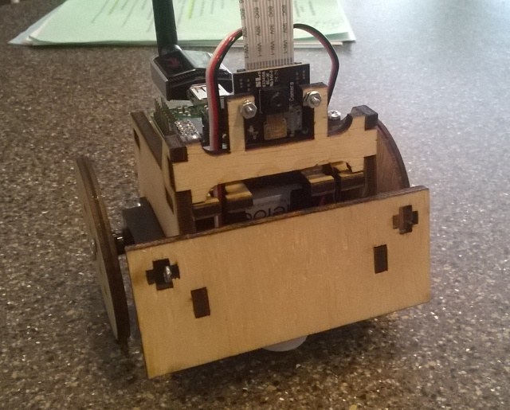

# ElixirBot

## Parts

The following lists all of the parts except for the laser cut frame and 3D
printed ball bearing holder. If you have a local hackerspace or Fab Lab, you're
in luck. If not, companies like Pololu and Ponoko will do it for you, but I have
not tested the designs with either of them.

  - Raspberry Pi Model A+ - $20
  - Pi Camera - $30
  - 2 [Spring RC SM-S4303R Servos](https://www.pololu.com/product/1248) - $26
  - WiFi dongle
  - [Daughter board PCB](https://oshpark.com/shared_projects/lCHfJqx6) - $3
  - [Pololu 5V Step-Up/Step-Down Voltage Regulator S7V7F5](https://www.pololu.com/product/2119) - $5
  - [4-AA Battery Holder](https://www.pololu.com/product/1153) - $1
  - [8-pin DIP socket](http://www.digikey.com/product-detail/en/A08-LC-TT/AE9986-ND/821740)
  - [10 position socket](http://www.digikey.com/product-detail/en/61301021821/732-2861-ND/2508630)
  - [2 position, 2.54 mm terminal block](http://www.digikey.com/product-detail/en/OSTVN02A150/ED10561-ND/1588862)
  - [ATtiny85](http://www.digikey.com/product-detail/en/ATTINY85-20PU/ATTINY85-20PU-ND/735469) - $2
  - [16 mm ball bearing](http://www.mcmaster.com/#9292k53/=w80vpw) - $1
  - [3/8" #6 pan head screws](http://www.mcmaster.com/#90190a146/=w80x6q)
  - [3/8" #4 pan head screws](http://www.mcmaster.com/#90190a103/=w80y2f)
  - [7/16" 4-40 F-F standoffs](https://www.pololu.com/category/114/female-female-standoffs)
  - [5/16" 4-40 machine screws](https://www.pololu.com/product/1961)
  - [4-40 machine hex nuts](https://www.pololu.com/product/1068)
  - [2-56 machine hex nuts](https://www.pololu.com/product/1067)
  - [5/16" 2-56 machine screws](https://www.pololu.com/product/1956)
  - [.1" header header]()
  - [.1" short]()
  - [10K resister 0805 package]()
  - [.1 uF capacitor 0805 package]()
  - MicroSD card
  - Rechargable AA batteries - Eneloop or other ~2000 mAh batteries

Very useful items:

  - [3V FTDI cable](https://www.sparkfun.com/products/9717)

## Building the frame

The robot frame is a modification of the awesome [SumoBot
Jr.](http://sumobotkit.com). I've made the following modifications to the
original design:

  1. Changed screw hole locations to mount a Raspberry Pi Model A
  2. Added a mount for a Pi Camera up front
  3. Added more room for batteries and enlarged the servo hole slightly
  4. Modified the wheels to screw into the servo horn rather than directly
     attaching (not completely sure that this is an improvement)

The `dxf` containing the laser cutter pattern was created in
[QCad](http://qcad.org). I cut the pattern in 5 mm birch plywood using a Full
Spectrum laser cutter. The Full Spectrum driver isn't smart about which lines to cut
first like the Epilog and Universal Laser drivers, so it has the cuts divided
into "first" and "second" passes.

## Building the electronics

First, order a PCB from [OSH Park](https://oshpark.com/shared_projects/lCHfJqx6).

IMPORTANT: I messed up the drill size for the 4-40 mounts, so the mounting holes
on the daughterboard need to be manually enlarged with a 7/64" drill bit. Don't
worry, I left clearance.

Solder the surface mount parts first. For the 10K resisters, make sure that you
have the orientation correct (same direction as silkscreen label). You'll see
what I mean.

The remaining components are fairly straightforward to solder since they're
through-hole. I didn't solder in the ISP connector, since I programmed the
ATtiny85 chips before plugging them into the board.

See the [ATtiny85 program](https://github.com/fhunleth/elixirbot/blob/master/hw/bot_attiny_controller/bot_attiny_controller.ino)
for build and programming instructions.

## Building

  1. Build a `nerves_rpi_elixirbot_defconfig` configuration of Nerves
  2. `. ./nerves-env.sh` in the Nerves directory
  3. Go here and run `make`

